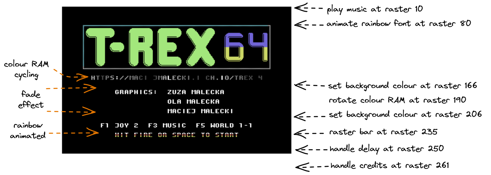

= Copper 64

The Coppper 64 library is a tool that eases complex raster-related effects that can be achieved by Commodore 64.

Raster-related effects are all effects that are triggered at certain raster line.
The Commodore 64 and its VIC-II chip can be programmed in a way so that CPU is interrupted once certain raster line of the screen is drawn by CRT (or LCD).
If this interrupt then performs certain actions, sometimes even by reprogramming of VIC-II itself, a wide variety of interesting effects can be achieved:

* splitting the screen into two or more pieces each using different screen mode or addressing,
* extending amount of visible colours by changing global colour registers of VIC-II,
* extending amount of visible sprites by reusing eight available sprite slots in different regions of the screen (so-called sprite multiplexing),
* displaying colorful raster bars or achieving "rainbow fonts",
* performing certain video-RAM operations at given moments to achieve smooth scrolling,
* doing any "background task" that requires regular update such as playing music or incrementing timers,
* and many more...

Usually you need to perform various raster-relation actions at once, on single screen.
This means that you need to perform several different handling code for several different raster times.
Unfortunately, the VIC-II chip and its interrupt system allows just to specify single raster value at a time - that is, you can only trigger an interrupt at single line.

This is a limitation that can be overcame: all you need to do is to reprogram VIC-II raster register at the end of interrupt handling method, maybe also reprogram IRQ vector of MOS 6502 so that the VIC-II will execute second IRQ handler at second position.
Of course, you have to reprogram raster register at the end of the second IRQ handler, the same needs to be done for IRQ vector.
This way you have two distinct IRQ handlers fired at two distinct raster positions.

This approach can be generalized to N handlers and raster positions.
Of course at each time you have to ensure that:

. Raster position grows except the very last position which should reset to the lowest raster at the end.
. You have to ensure that IRQ handler have enough time to execute itself (the next raster position must be big enough so that we have enough cycles to execute the whole IRQ handler).

Not conforming to any of the rules above results in effect called "frame-skips", that is the VIC-II will display the whole frame before next handler will be run.

Futhermore, the MOS 6502 are unstable by default, that is, it is usually hard to predict when exactly the code execution by the CPU will be interrupted.
Some visual effects are affected by this problem, prominently screen splits and raster bars.
Special programming techniques including code cycling and double interrupts are used to mitigate this problem.

The Copper 64 library solves most of these problems.
It is configured via special table allowing to specify various effects being triggered at raster lines.
The design of this library has been inspired by Amiga's Copper chip (and so-called Copper list) or 8-bit Atari's display list.

.Related sources
--
* `c64lib/copper64/lib/copper64.asm`.
* `c64lib/copper64/lin/copper64-global.asm`.
--

== Defining Copper table

Copper table is a block of memory containing copper entries, 4 bytes each.

.Copper 64 entry definition
[cols="1,1,3"]
|===
| Byte offset | Name | Description

| 0 | Control | Control byte serving different purposes (see below).
| 1 | Raster | Lower 8 bits of raster line address.
| 2 | Data 1 | First byte of data.
| 3 | Data 2 | Second byte of data.
|===

The control byte has multiple purposes depending on its value:

.Control value
[cols="1,3"]
|===
| Control value | Description

| `$00` | Stop execution of the copper list.
| `$FF` | End of the copper list (start from the beginning - loop).
| `$01` - `$FE` | Execute function (see below).
|===

For values from range `$01` - `$FE` the bits of the control byte have following meanings.

.Function selector structure
[cols="1,3"]
|===
| Bit | Description

| `7` | Nineth bit of the raster line address.
| `6` | Reserved, should be 0.
| `5` | Reserved, should be 0.
| `4..0` | IRQ Function - 1..31.
|===

There are two macros that can be used to simplify copper table definition:

`copperEntry`:: Creates single effect line of copper list. This macro takes following arguments: `raster` - raster counter (9 bits), `function` - IRQ handler code, `data1` - first byte of function data, `data2` - second byte of function data.
`copperLoop`:: Is used to finish copper list - the copper 64 wraps to the first line once loop line is detected. This macro does not take any arguments.

== Copper 64 main subroutine

The main Copper 64 subroutine must be preconfigured using hosted subroutine approach.

Copper 64 requires three bytes from zero page: two subsequent bytes to store copper list address and one byte for copper list pointer.

Install main subroutine with following macro call:

[source,asm]
----
.label COPPER_LIST_ADDR = $10
.label COPPER_LIST_PTR = $12

startCopper(
    COPPER_LIST_ADDR,
    COPPER_LIST_PTR,
    List().add(c64lib.IRQH_JSR, c64lib.IRQH_BG_RASTER_BAR, c64lib.IRQH_BG_COL_0).lock())
----

Note that all three location on the zero page can be freely configured via first and second parameter of the macro call.

As the third argument you have to pass a locked list of all IRQ handlers you are going to use in copper list.
That is, even though Copper 64 supports more than dozen of different effects, only few of them can be used at once (this limitation is caused by the fact, that Copper 64 is cycled to achieve stable effects, therefore all handlers must fit into single page of memory).

Once hosted subroutine is installed and configured, you can make call to it, ensuring that firstly you set up copper list address into appropriate zero page location.
This way you can easily reuse the same main subroutine for different copper list, this works well as long as you use the same set of IRQ handlers in all of these lists.
If by any reason you cannot use the same list of IRQ handlers (because i.e. they do not fit into 256 bytes of memory), you have to configure and install main subroutine twice.

== Stop Copper 64 subroutine

Basically you have to stop IRQ to have Copper 64 deactivated, or reprogram IRQ vector, or both.
You can use the following macro to just turn VIC-II initiated IRQ off:

[source,asm]
----
stopCopper()
----

== Copper 64 effects

=== Set border color
Changes border color.

* __Handler label:__ `IRQH_BORDER_COL`
* __Handler code:__ `1`
* __Argument 1:__ desired border color; `0..15`
* __Argument 2:__ unused
* __Cycled:__ yes (PAL, 63 cycles)

Usage:
[source,asm]
----
copperEntry(<raster>, c64lib.IRQH_BORDER_COL, <color>, 0)
----

=== Set background color 0
Changes background color 0.

* __Handler label:__ `IRQH_BG_COL_0`
* __Handler code:__ `2`
* __Argument 1:__ desired background 0 color; `0..15`
* __Argument 2:__ unused
* __Cycled:__ yes (PAL, 63 cycles)

Usage:
[source,asm]
----
copperEntry(<raster>, c64lib.IRQH_BG_COL_0, <color>, 0)
----

=== Set background color 1
Changes background color 1.

* __Handler label:__ `IRQH_BG_COL_1`
* __Handler code:__ `3`
* __Argument 1:__ desired background 1 color; `0..15`
* __Argument 2:__ unused
* __Cycled:__ yes (PAL, 63 cycles)

Usage:
[source,asm]
----
copperEntry(<raster>, c64lib.IRQH_BG_COL_1, <color>, 0)
----

=== Set background color 2
Changes background color 2.

* __Handler label:__ `IRQH_BG_COL_2`
* __Handler code:__ `4`
* __Argument 1:__ desired background 2 color; `0..15`
* __Argument 2:__ unused
* __Cycled:__ yes (PAL, 63 cycles)

Usage:
[source,asm]
----
copperEntry(<raster>, c64lib.IRQH_BG_COL_2, <color>, 0)
----

=== Set background color 3
Changes background color 3.

* __Handler label:__ `IRQH_BG_COL_3`
* __Handler code:__ `5`
* __Argument 1:__ desired background 3 color; `0..15`
* __Argument 2:__ unused
* __Cycled:__ yes (PAL, 63 cycles)

Usage:
[source,asm]
----
copperEntry(<raster>, c64lib.IRQH_BG_COL_3, <color>, 0)
----

=== Set border and background 0 color uniformly
Changes background color 0 and border color to the same color.

* __Handler label:__ `IRQH_BORDER_BG_0_COL`
* __Handler code:__ `6`
* __Argument 1:__ desired color for border and background 0; `0..15`
* __Argument 2:__ unused
* __Cycled:__ yes (PAL, 63 cycles)

Usage:
[source,asm]
----
copperEntry(<raster>, c64lib.IRQH_BORDER_BG_0_COL, <color>, 0)
----

=== Set border and background 0 color separately
Changes background color 0 and border color to another values in single step, the colors are specified as arguments.

* __Handler label:__ `IRQH_BORDER_BG_0_DIFF`
* __Handler code:__ `7`
* __Argument 1:__ desired color for border; `0..15`
* __Argument 2:__ desired color for background 0; `0..15`
* __Cycled:__ yes (PAL, 63 cycles)

Usage:
[source,asm]
----
copperEntry(<raster>, c64lib.IRQH_BORDER_BG_0_DIFF, <border color>, <background color>)
----

=== Set VIC memory register and VIC memory bank
Changes VIC memory control and VIC memory bank in one step.

* __Handler label:__ `IRQH_MEM_BANK`
* __Handler code:__ `8`
* __Argument 1:__ value for `MEMORY_CONTROL` register
* __Argument 2:__ value for VIC bank (goes to `CIA2_DATA_PORT_A`); only two least significant bits are taken, other bits of the data port are preserved
* __Cycled:__ yes (PAL, 63 cycles)

Usage:
[source,asm]
----
copperEntry(<raster>, c64lib.IRQH_MEM_BANK, <memory control>, <vic bank number>)
----

=== Set VIC mode and memory settings
Changes VIC display mode and memory settings in one step. VIC bank cannot be changed.

* __Handler label:__ `IRQH_MODE_MEM`
* __Handler code:__ `9`
* __Argument 1:__ mode of vic2; for performance reasons the values for two control registers are packed in one byte: `%00010000` for Multicolor, `%01100000` for ECM or Bitmap
* __Argument 2:__ value for `MEMORY_CONTROL` register
* __Cycled:__ yes (PAL, 63 cycles)

Usage:
[source,asm]
----
copperEntry(<raster>, c64lib.IRQH_MODE_MEM, <vic mode>, <memory control>)
----

=== Jump to custom subroutine
Jumps to custom subroutine that can do whatever you want, i.e. play music. Subroutine must end with `rts`.

* __Handler label:__ `IRQH_JSR`
* __Handler code:__ `10`
* __Argument 1:__ Low byte of subroutine address
* __Argument 2:__ High byte of subroutine address
* __Cycled:__ no

Usage:
[source,asm]
----
copperEntry(<raster>, c64lib.IRQH_JSR, <address, >address)
----

=== Set hires bitmap mode
Sets up hires bitmap mode using given memory layout and VIC bank. Useful for screen splits using totally different memory locations for VIC chip.

* __Handler label:__ `IRQH_MODE_HIRES_BITMAP`
* __Handler code:__ `11`
* __Argument 1:__ value for `MEMORY_CONTROL` register
* __Argument 2:__ value for VIC bank (goes to `CIA2_DATA_PORT_A`); only two least significant bits are taken, other bits of the data port are preserved
* __Cycled:__ yes (PAL, 63 cycles)

Usage:
[source,asm]
----
copperEntry(<raster>, c64lib.IRQH_MODE_HIRES_BITMAP, <memory control>, <vic bank number>)
----

=== Set multicolor mode
Sets up multicolor bitmap mode using given memory layout and VIC bank. Useful for screen splits using totally different memory locations for VIC chip.

* __Handler label:__ `IRQH_MODE_MULTIC_BITMAP`
* __Handler code:__ `12`
* __Argument 1:__ value for `MEMORY_CONTROL` register
* __Argument 2:__ value for VIC bank (goes to `CIA2_DATA_PORT_A`); only two least significant bits are taken, other bits of the data port are preserved
* __Cycled:__ yes (PAL, 63 cycles)

Usage:
[source,asm]
----
copperEntry(<raster>, c64lib.IRQH_MODE_MULTIC_BITMAP, <memory control>, <vic bank number>)
----

=== Set hires text mode
Sets up hires text mode using given memory layout and VIC bank. Useful for screen splits using totally different memory locations for VIC chip.

* __Handler label:__ `IRQH_MODE_HIRES_TEXT`
* __Handler code:__ `13`
* __Argument 1:__ value for `MEMORY_CONTROL` register
* __Argument 2:__ value for VIC bank (goes to `CIA2_DATA_PORT_A`); only two least significant bits are taken, other bits of the data port are preserved
* __Cycled:__ yes (PAL, 63 cycles)

Usage:
[source,asm]
----
copperEntry(<raster>, c64lib.IRQH_MODE_HIRES_TEXT, <memory control>, <vic bank number>)
----

=== Set multicolor text mode
Sets up multicolor text mode using given memory layout and VIC bank. Useful for screen splits using totally different memory locations for VIC chip.

* __Handler label:__ `IRQH_MODE_MULTIC_TEXT`
* __Handler code:__ `14`
* __Argument 1:__ value for `MEMORY_CONTROL` register
* __Argument 2:__ value for VIC bank (goes to `CIA2_DATA_PORT_A`); only two least significant bits are taken, other bits of the data port are preserved
* __Cycled:__ yes (PAL, 63 cycles)

Usage:
[source,asm]
----
copperEntry(<raster>, c64lib.IRQH_MODE_MULTIC_TEXT, <memory control>, <vic bank number>)
----

=== Set extended background mode
Sets up extended text mode using given memory layout and VIC bank. Useful for screen splits using totally different memory locations for VIC chip.

* __Handler label:__ `IRQH_MODE_EXTENDED_TEXT`
* __Handler code:__ `15`
* __Argument 1:__ value for `MEMORY_CONTROL` register
* __Argument 2:__ value for VIC bank (goes to `CIA2_DATA_PORT_A`); only two least significant bits are taken, other bits of the data port are preserved
* __Cycled:__ yes (PAL, 63 cycles)

Usage:
[source,asm]
----
copperEntry(<raster>, c64lib.IRQH_MODE_EXTENDED_TEXT, <memory control>, <vic bank number>)
----

=== Full raster bar
Generates colorful raster bar across whole screen including border. Color for each subsequent bar line is fetched from `$FF` terminated array of colors (values `0..15`). Because procedure is cycled using busy waiting on raster, a raster time for whole bar will be consumed. Color array can be cycled or modified in any way to get interesting animation effects.

* __Handler label:__ `IRQH_FULL_RASTER_BAR`
* __Handler code:__ `16`
* __Argument 1:__ Low byte of bar color definition address
* __Argument 2:__ High byte of bar color definition address
* __Cycled:__ yes (PAL, 63 cycles) - it sucks on badlines however

Usage:
[source,asm]
----
copperEntry(<raster>, c64lib.IRQH_FULL_RASTER_BAR, <address, >address)
----

=== Background-only raster bar
Generates colorful raster bar across whole background. Color for each subsequent bar line is fetched from `$FF` terminated array of colors (values `0..15`). Because procedure is cycled using busy waiting on raster, a raster time for whole bar will be consumed. Color array can be cycled or modified in any way to get interesting animation effects.

* __Handler label:__ `IRQH_BG_RASTER_BAR`
* __Handler code:__ `17`
* __Argument 1:__ Low byte of bar color definition address
* __Argument 2:__ High byte of bar color definition address
* __Cycled:__ yes (PAL, 63 cycles)

Usage:
[source,asm]
----
copperEntry(<raster>, c64lib.IRQH_BG_RASTER_BAR, <colorCycleDef, >colorCycleDef)
...
colorCycleDef:  .byte COLOR_3, LIGHT_RED, RED, LIGHT_RED, YELLOW, WHITE, YELLOW, YELLOW, COLOR_3, $ff
----

=== Horizontal scroll
Scrolls screen horizontally using specified amount of pixels.

* __Handler label:__ `IRQH_HSCROLL`
* __Handler code:__ `17`
* __Argument 1:__ value for horizontal scroll register (`0..7`)
* __Argument 2:__ unused
* __Cycled:__ yes (PAL, 63 cycles)

Usage:
[source,asm]
----
copperEntry(<raster>, c64lib.IRQH_HSCROLL, <scroll value>, 0)
----

=== Mapped horizontal scroll
Applies shallow tech-tech effect (using values `0..7`) starting from given raster position. Horizontal scroll value for each corresponding raster line is taken from `$FF` terminated array of values, each should contain value from `0..7` range. The scroll map can be further modified (i.e. rotated) to achieve interesting animation effects.

* __Handler label:__ `IRQH_HSCROLL_MAP`
* __Handler code:__ `17`
* __Argument 1:__ low byte of scroll map definition address
* __Argument 2:__ high value of scroll map definition address
* __Cycled:__ yes (PAL, 63 cycles)

Usage:
[source,asm]
----
copperEntry(<raster>, c64lib.IRQH_HSCROLL_MAP, <hscrollMapDef, >hscrollMapDef)
...
hscrollMapDef:  .fill TECH_TECH_WIDTH, round(3.5 + 3.5*sin(toRadians(i*360/TECH_TECH_WIDTH))) ; .byte 0; .byte $ff
----

== Examples

=== Level screen for a TRex-64 game

We would like to display a new level screen for a https://maciejmalecki.itch.io/trex64[video game].
This screen should play background music, display some information and handle controls to start the game when player is ready.
Lets consider the following requirements:

. Music player should be triggered once per frame.
. Regular font used on this screen should use "rainbow font" effect using smooth shades of grey.
. Get ready text should use different shades (yellow and red like fire) which is additionally animated by cycling the rainbow.
. We need a counter that can be used to calculate delay - this is required to handle keyboard input properly.

The whole screen can be built using following copper table:

[source,asm]
----
copperList:
    copperEntry(10, IRQH_JSR, <playMusic, >playMusic)
    copperEntry(80, IRQH_JSR, <scrollColorCycle2, >scrollColorCycle2)
    copperEntry(124, IRQH_BG_RASTER_BAR, <colorCycle1, >colorCycle1)
    copperEntry(140, IRQH_BG_RASTER_BAR, <colorCycle2, >colorCycle2)
    copperEntry(156, IRQH_BG_RASTER_BAR, <colorCycle1, >colorCycle1)
    copperEntry(245, IRQH_JSR, <dly_handleDelay, >dly_handleDelay)
    copperLoop()
----

For background raster bar effect we use following arrays defining color cycles:

[source,asm]
----
colorCycle1: .byte GREY, GREY, GREY, LIGHT_GREY, WHITE, WHITE, LIGHT_GREY, GREY, GREY, BLACK, $ff
colorCycle2: .byte BLACK, LIGHT_RED, RED, LIGHT_RED, YELLOW, YELLOW, WHITE, YELLOW, YELLOW, BLACK, $ff
----

Additionally, the content of `colorCycle2` array is rotated using the following code, that is triggered by second entry of the copper table:

[source,asm]
----
scrollColorCycle2: {
  dec z_colorCycleDelay2
  bne !+
    lda #COLOR_CYCLE_DELAY
    sta z_colorCycleDelay2
    rotateMemRightFast(colorCycle2 + 1, 6)
  !:
  rts
}
----

Note that it is essential, that last byte of the colour cycle entry is the same as the screen colour (`BLACK` in this case) - this restores bg colour of the screen remainder.

Also note, that "rainbow" font effect requires inverted charset to be used, because rainbow is done via rasterbar effect on background colour.

The Copper 64 main subroutine can be configured in following way:

[source,asm]
----
startCoopper:
  startCopper(
    $03,
    $05,
    List().add(c64lib.IRQH_JSR, c64lib.IRQH_BG_RASTER_BAR).lock())
----

Main subroutine can be then started multiple time using the following code:

[source,asm]
----
  lda #<copperList
  sta $03
  lda #>copperList
  sta $04
  jsr startCopper
----

As shown above, the Copper 64 subroutine can be easily reused with different copper lists as long as the same effects are used.
All to be done is to set up copper list address which is in this example stored in addresses `$03` and `$04`.

=== Title screen for a TRex-64 game

The title screen for the TRex-64 video game uses rainbow fonts, both static and animated as well as fade in/fade out effect on credits/instruction text.
The fade effect is also done with background colour, so also inverted charset must be used to hide all parts of the background that shouldn't be visible.

This screen is implemented with following copper list:

[source,asm]
----
titleScreenCopperList:
        copperEntry(10, IRQH_JSR, <playMusic, >playMusic)
        copperEntry(80, IRQH_JSR, <scrollColorCycle2, >scrollColorCycle2)
    fadeEffectColor:
        copperEntry(166, IRQH_BG_COL_0, BLACK, 0)
        copperEntry(190, IRQH_JSR, <rotateColors, >rotateColors)
        copperEntry(206, IRQH_BG_COL_0, BLACK, 0)
        copperEntry(235, IRQH_BG_RASTER_BAR, <colorCycle2, >colorCycle2)
        copperEntry(250, IRQH_JSR, <dly_handleDelay, >dly_handleDelay)
        copperEntry(261, IRQH_JSR, <handleCredits, >handleCredits)
        copperLoop()
----

In this example we see that copper list can be modified in runtime.
Here we modify the background colour at the begining of the fade in section.
In another place (`handleCredits`) we modify this value with simple:

[source,asm]
----
    sta fadeEffectColor + 2
----

Just each time you want to fade in or out, we have to change colours according to special fade in / fade out array of colours.

=== Supporting both PAL and NTSC

We all know that NTSC on C64 is hard, because there are far less raster lines per frame (due to the fact that VIC-II does 60Hz vs 50Hz in PAL).
But what is even harder and more awkward: while PAL version has 0 raster line at the very top of the screen, the raster 0 on NTSC is near at the bottom.

For PAL we do have 312 raster lines, and v-blank starts at 300 (the very bottom of the visible screen area).
for NTSC we have 263 raster lines, v-blank starts at line 13 (so raster lines 0 to 12 are visible at the very bottom of the screen).
So, lets assume we would like to set up an interrupt at the line 251 (PAL).
To have this interrupt to be triggered in exactly the same place on NTSC, we do need to set it up in line 1.

Therefore in order to make our copper list work equally well on PAL and NTSC we do have to:

. Detect which machine are we running on (PAL / NTSC).
. Modify copper list accordingly (change 251 to 1 if on NTSC).

Let's consider following copper list:
[source,asm]
----
ingameCopperList:
    copperEntry(DASHBOARD_Y + 20, IRQH_JSR, <upperMultiplex, >upperMultiplex) // 50 + 20 = 70
    copperEntry(77, IRQH_JSR, <playMusicIrq, >playMusicIrq)
  scrollCode:
    copperEntry(103, IRQH_JSR, <scrollBackground, >scrollBackground)
  switchPagesCode:
    copperEntry(280, IRQH_JSR, <switchPages, >switchPages)
    copperLoop()
----

We see that the last raster line is way beyond of the NTSC display capabilities.
In fact, IRQ at 280 will never be triggered on NTSC machine.
In short, the following raster table will not work there.
We have to detect NTSC and modify the table accordingly.

[source,asm]
----
startIngameCopper: {
  lda #<ingameCopperList
  sta z_displayListPtr
  lda #>ingameCopperList
  sta z_displayListPtr + 1

  lda z_ntsc
  bne ntsc
  jmp !+
  ntsc: {
    // for NTSC we want to change raster counter for last IRQ handler (switch pages)
    lda #8
    sta switchPagesCode + 1
    lda switchPagesCode
    and #%01111111
    sta switchPagesCode
  }
  !:
    jsr startCopper
  rts
}
----

Note that we have to change both byte 0 and 1 of the copper list entry - this is because we have to also clear bit 9 of the raster counter, which is stored in control byte.

To detect NTSC we can use the following code:

[source,asm]
----
setNTSC: {
  lda #1
  sta z_ntsc
  rts
}

detectNTSC: {
  lda #0
  sta z_ntsc
  detectNtsc(0, setNTSC)
  rts
}
----
