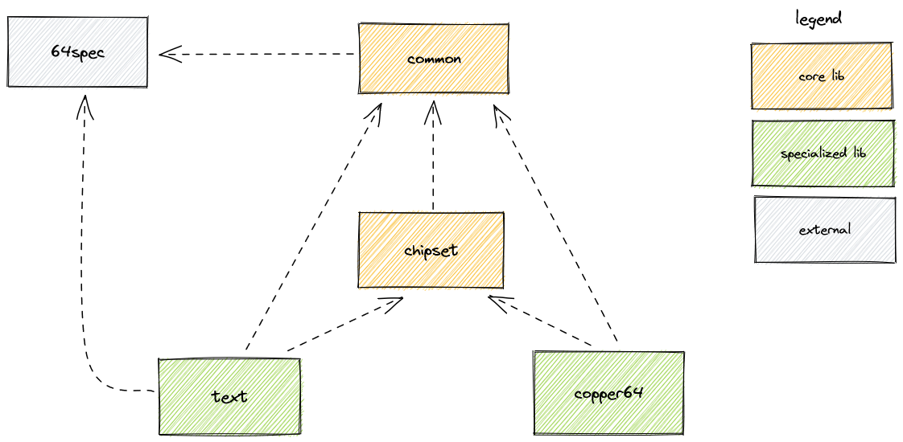

== Overview
The C64Lib project consists of multiple libraries. Each library is hosted as separate GitHub repository and is plugged into CircleCI build system for Continuous Integration.

There are following core libraries:

common:: The one that hosts some commonly used functions, macros and subroutines; no other `c64lib` library can work without it. This code is intended to be platform-independent, it complies to typical MOS 6502 assembler syntax (except it is written in KickAss, which is C64 specific at the moment).
chipset:: The one that hosts code that is platform specific and is dedicated to handle typical C64 chipset such as VIC-II, SID, CIA as well as typical C64 memory layout.
text:: The one that handles displaying text in text mode of Commodore 64 / VIC-II.
copper64:: Utility library that makes raster interrupt programming on VIC-II pleasant and easy.

The diagram below describes dependencies between internal libraries of `c64lib` project. There is also an excellent `64spec` testing library used and shown as external reference.

